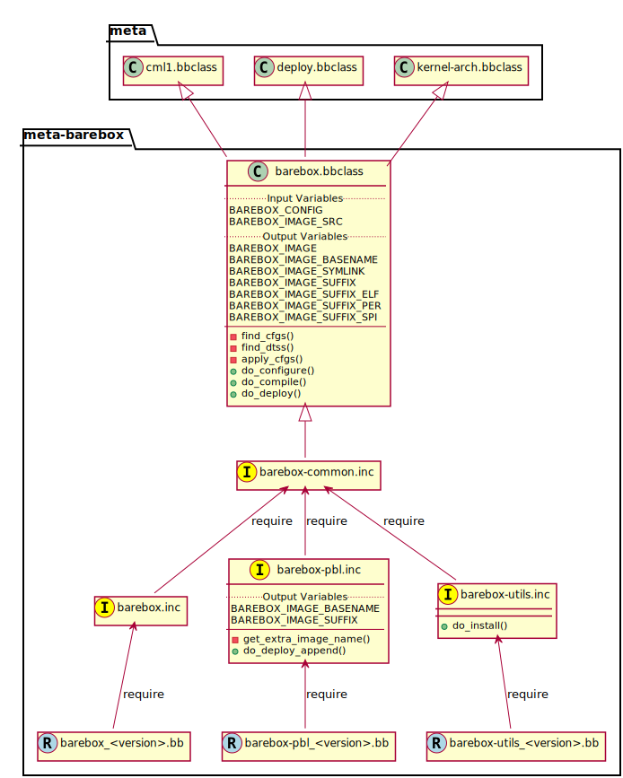

# Reference Manual for `meta-barebox`

- **Author:**  Dennis Menschel <<menschel-d@posteo.de>>
- **Date:**    2017-07-08
- **Version:** Yocto 2.3 (pyro)


## Table of contents

1. [Intro](#intro)
   1. [Features](#features)
2. [Interface](#interface)
   1. [Input variables](#input-variables)
   2. [Output variables](#output-variables)
3. [Common tasks](#common-tasks)
   1. [Machine configuration](#machine-configuration)
   2. [Barebox configuration](#barebox-configuration)
   3. [Default environment modification](#default-environment-modification)
4. [Examples](#examples)
   1. [BeagleBone Black](#beaglebone-black)
      1. [Machine configuration](#machine-configuration)
      2. [Building barebox](#building-barebox)
      3. [Booting from microSD card](#booting-from-microsd-card)
      4. [Booting from UART0](#booting-from-uart0)
5. [FAQ](#faq)
   1. [Why a separate layer for the bootloader barebox?](#why-a-separate-layer-for-the-bootloader-barebox)
   2. [Can the interface of this layer be considered stable?](#can-the-interface-of-this-layer-be-considered-stable)
6. [Todo](#todo)


## Intro

This document is a reference manual for the `meta-barebox` layer.
It is intended to resemble the [Yocto Project Reference Manual][]
in terms of interface definition and usage guidelines.

[Yocto Project Reference Manual]:
<https://www.yoctoproject.org/docs/latest/ref-manual/ref-manual.html>


### Features

This layer provides the barebox bootloader along with the following features:

- Pure software layer that is not bound to a specific hardware BSP.
- Support for pre-bootloader.
- Support for target tools.
- Well-defined interface.
- Clean include-hierarchy for recipes to minimize redundancy.
- Documentation in form of a reference manual.


## Interface

This section describes the BitBake variables that together define the
public interface of the barebox recipes.
The following diagram illustrates where these BitBake variables are set and
how the recipes are structured:




### Input variables

The BitBake variables in this section influence what should be built by the
barebox recipes.
The appropriate value of each variable depends on the target hardware.
Therefore these variables should be set in the machine configuration file
inside some BSP layer.


- `BAREBOX_CONFIG`\
  The configuration for the *kbuild* build system to use when building
  barebox.

  Default value: `""`


- `BAREBOX_IMAGE_SRC`\
  This option is intended for configurations that produce multiple images
  for different target variants.
  In that case, an entry must be selected from the contents of the file
  `barebox-flash-images` which will be located in the build directory of
  barebox after it has been built once.

  For example, if you choose `BAREBOX_CONFIG = "am335x_defconfig"`,
  then the contents of the aforementioned file might be as follows:

  ```ShellSession
  $ cd <barebox build directory>
  $ cat barebox-flash-images
  images/barebox-am33xx-afi-gf.img
  images/barebox-am33xx-phytec-phycore.img
  images/barebox-am33xx-phytec-phycore-no-spi.img
  images/barebox-am33xx-phytec-phycore-no-eeprom.img
  images/barebox-am33xx-phytec-phycore-no-spi-no-eeprom.img
  images/barebox-am33xx-phytec-phyflex.img
  images/barebox-am33xx-phytec-phyflex-no-spi.img
  images/barebox-am33xx-phytec-phyflex-no-eeprom.img
  images/barebox-am33xx-phytec-phyflex-no-spi-no-eeprom.img
  images/barebox-am33xx-phytec-phycard.img
  images/barebox-am33xx-beaglebone.img
  ```

  Default value: `"barebox.bin"`


### Output variables

The BitBake variables in this section influence how the generated output files
will be organized in the deploy directory.
They are designed for the following use cases:

- Further processing of the output files, e.g. by image recipes or 3rd party
  tools.
- Renaming the output files such that they can be found by the ROM bootloader
  of a specific target hardware.

<!-- -->

- `BAREBOX_IMAGE`\
  The complete file name of the generated image file without any
  file extension.

  Default value: `"${BAREBOX_IMAGE_BASENAME}-${PV}-${PR}-${MACHINE}-${DATETIME}"`


- `BAREBOX_IMAGE_BASENAME`\
  The basename for the bootloader image.
  It is implicitly used to distinguish between the main bootloader and an
  optional pre-bootloader.
  If the ROM bootloader of the target hardware expects a specific file name
  that is different from the default value, it can be adjusted with this
  BitBake variable (and the appropriate suffix variable).

  Default value: `"${PN}"`


- `BAREBOX_IMAGE_SUFFIX`\
  The file extension for the bootloader image.

  Default value: `".bin"`


- `BAREBOX_IMAGE_SUFFIX_ELF`\
  The file extension for the bootloader image in Executable and Linkable
  Format (ELF).

  Default value: `".elf"`


- `BAREBOX_IMAGE_SUFFIX_PER`\
  The file extension for the peripheral bootloader image.

  Default value: `".per"`


- `BAREBOX_IMAGE_SUFFIX_SPI`\
  The file extension for a specific image variant that can boot from SPI.
  This is of relevance if you build `barebox-pbl` with the config option
  `CONFIG_OMAP_BUILD_SPI`.

  Default value: `".spi"`


- `BAREBOX_IMAGE_SYMLINK`\
  A symbolic name to the most recent build of the bootloader,
  without any file extension.

  Default value: `"${BAREBOX_IMAGE_BASENAME}"`


## Common tasks

This section gives a short introduction to common tasks when working with
barebox.
Modifications of barebox usually take place either in a BSP layer to
adapt it to a particular hardware, or in a distribution layer to ensure
a common feature set or default environment.


### Machine configuration

This section assumes that the BitBake variables for barebox are set in a
machine configuration file inside of a BSP layer.
If you intend to specify these settings elsewhere, e.g. in
`conf/local.conf` or in your distribution configuration, you have to
add an appropriate machine overrides suffix to the BitBake variables in
this section.

First of all, you need to select a default configuration for the build system
of barebox.
This configuration determines for which machine barebox should be built
and which features should be included.
You can use the following shell command to list the available default
configurations:

```ShellSession
$ find <barebox source directory> -type f -name "*_defconfig"
```

After selecting the appropriate configuration, place its filename into the
`BAREBOX_CONFIG` variable:

```BitBake
BAREBOX_CONFIG = "<bootloader configuration>"
```

To figure out what value to place in `BAREBOX_IMAGE_SRC`, you can build
barebox with the configuration that you selected in the previous step.
Once barebox has been built, the file `barebox-flash-images` in its build
directory will contain a list of produced images.
Among these entries, select the one which best suits you machine:

```BitBake
BAREBOX_IMAGE_SRC = "<bootloader image>"
```

Last but not least, the machine needs to be listed in the
`COMPATIBLE_MACHINE` variable for barebox:

```BitBake
COMPATIBLE_MACHINE_pn-barebox = "<machine>"
```

If the machine requires a pre-bootloader in order to work, you need to set
these variables for the recipe `barebox-pbl` as well (using overrides).
Furthermore, the pre-bootloader package needs to be added to the
runtime-dependencies of barebox:

```BitBake
BAREBOX_CONFIG_pn-barebox-pbl = "<pre-bootloader configuration>"
BAREBOX_IMAGE_SRC_pn-barebox-pbl = "<pre-bootloader image>"
RDEPENDS_barebox += "barebox-pbl"
COMPATIBLE_MACHINE_pn-barebox-pbl = "<machine>"
```

### Barebox configuration

Barebox uses the Linux kernel build system *kbuild* to manage its
configuration.
This build system is supported by the `cml1` class from the `meta` layer.
It provides the BitBake tasks `menuconfig` and `diffconfig`.
The former task is used to modify the configuration while the latter task
is used to generate *configuration fragments* which either enable or disable
certain features of barebox.
For more information on how to use these BitBake tasks, you can refer to the
[Yocto Project Linux Kernel Development Manual][].

[Yocto Project Linux Kernel Development Manual]:
<https://www.yoctoproject.org/docs/latest/kernel-dev/kernel-dev.html>


### Default environment modification

With its environment framework, barebox already provides a versatile
infrastructure to construct its default environment from a sequence
of overlays.

| Directory                       |  Description           |
| ------------------------------- | ---------------------- |
| `defaultenv/defaultenv-2-base`  | base files             |
| `defaultenv/defaultenv-2-dfu`   | overlay for DFU        |
| `defaultenv/defaultenv-2-menu`  | overlay for menus      |
| `arch/$ARCH/boards/<board>/env` | board specific overlay |

Therefore, you can just choose the overlay that best fits your purpose
and modify it accordingly.
For example, if you want to adapt the environment of barebox inside your
distribution layer to achieve a common behavior regardless of the board
on which it will run, it might be reasonable to patch the base overlay.
If you  work on a BSP layer instead, the preferred way would be to modify
the board specific overlay accordingly.
More information can be obtained by reading the official documentation on
the [Barebox Default Environment Version 2][].

[Barebox Default Environment Version 2]:
<http://barebox.org/doc/latest/user/defaultenv-2.html>


## Examples

This section demonstrates a proof of concept of how the `meta-barebox`
layer can be used.


### BeagleBone Black

This example shows how to build barebox for the popular BeagleBone Black and
how to run it from different boot sources like MMC and UART.
Fortunately the BeagleBone is already included in the `meta-yocto-bsp`
layer as a reference target.
Therefore we can edit `conf/local.conf` in the build directory and simply
select it:

```BitBake
MACHINE = "beaglebone"
```


#### Machine configuration

Next we have to extend the machine configuration for the BeagleBone.
This can be accomplished by appending the following lines to
`conf/local.conf`:

```BitBake
BAREBOX_CONFIG_beaglebone = "am335x_defconfig"
BAREBOX_CONFIG_pn-barebox-pbl_beaglebone = "am335x_mlo_defconfig"
BAREBOX_IMAGE_SRC_beaglebone = "images/barebox-am33xx-beaglebone.img"
BAREBOX_IMAGE_SRC_pn-barebox-pbl_beaglebone = "images/barebox-am33xx-beaglebone-mlo.img"
RDEPENDS_barebox_beaglebone += "barebox-pbl"
COMPATIBLE_MACHINE_pn-barebox_beaglebone = "beaglebone"
COMPATIBLE_MACHINE_pn-barebox-pbl_beaglebone = "beaglebone"
```

This sets the config for both bootloader parts and also lists the
pre-bootloader as a runtime-dependency of the main bootloader.
We also have to explicitly state that a specific target machine is
compatible with the barebox bootloader and its pre-bootloader.


#### Building barebox

After having extended the BeagleBone's machine configuration, we can now
invoke BitBake to build barebox:

```ShellSession
$ bitbake barebox
```

As we have listed `barebox-pbl` to be a runtime-dependency of `barebox`,
it will automatically be built along with the main bootloader.
The recipes `barebox` and `barebox-pbl` will each deploy their
output files in `${DEPLOYDIR}/${PN}-${PV}` respectively.


#### Booting from microSD card

In order for the ROM bootloader on the BeagleBone to boot from a microSD card
(MMC), this card needs to meet the following requirements:

- It must contain a DOS-style partition table.
- The first primary partition must be formatted with FAT32 and its
  bootable flag must be set. If this partition contains a file called `MLO`,
  the ROM bootloader will load it.

More information can be obtained from section 26.1.8.5 "MMC / SD Cards" of the
[Technical Reference Manual for the TI AM335x Sitara processor family][].

[Technical Reference Manual for the TI AM335x Sitara processor family]:
<http://www.ti.com/lit/pdf/spruh73>

After having formatted the microSD card, we need to copy the files
`barebox.bin` and `MLO` from the deploy directory to the card's first
partition.
To observe the boot process, a USB-to-TTL (3.3V) adapter should be attached
to the UART0 pin header on the BBB.
We can connect to it with a terminal emulator like e.g. `picocom`.
Now we can insert the microSD card into the BeagleBone Black and power it up
while pressing the boot switch on the BBB, so that it will not boot from its
internal eMMC flash.
The output on UART0 should look similar to the following:

```ShellSession
$ picocom -b 115200 /dev/ttyUSB0
picocom v1.7

port is        : /dev/ttyUSB0
flowcontrol    : none
baudrate is    : 115200
parity is      : none
databits are   : 8
escape is      : C-a
local echo is  : no
noinit is      : no
noreset is     : no
nolock is      : no
send_cmd is    : sz -vv
receive_cmd is : rz -vv
imap is        :
omap is        :
emap is        : crcrlf,delbs,

Terminal ready


barebox 2017.03.0 #1 Thu Jun 15 11:44:05 CEST 2017


Board: TI AM335x BeagleBone
detected 'BeagleBone Black'
omap-hsmmc 48060000.mmc: registered as 48060000.mmc
booting from MMC
mmc0: detected SD card version 2.0
mmc0: registered mmc0


barebox 2017.03.0 #1 Thu Jun 15 11:44:33 CEST 2017


Board: TI AM335x BeagleBone black
detected 'BeagleBone Black'
cpsw 4a100000.ethernet: detected phy mask 0x1
mdio_bus: miibus0: probed
eth0: got preset MAC address: ec:24:b8:9d:77:12
cpsw 4a100000.ethernet: Failed to setup slave 1: I/O error
am335x-phy-driver 47401300.usb-phy: am_usbphy 8ffb1be8 enabled
am335x-phy-driver 47401b00.usb-phy: am_usbphy 8ffb2f08 enabled
musb-hdrc: ConfigData=0xde (UTMI-8, dyn FIFOs, bulk combine, bulk split, HB-ISO Rx, HB-ISO Tx, SoftConn)
musb-hdrc: MHDRC RTL version 2.0
musb-hdrc: setup fifo_mode 4
musb-hdrc: 28/31 max ep, 16384/16384 memory
i2c-omap 44e0b000.i2c: bus 0 rev0.11 at 400 kHz
omap-hsmmc 48060000.mmc: registered as 48060000.mmc
mmc0: detected SD card version 2.0
mmc0: registered mmc0
omap-hsmmc 481d8000.mmc: registered as 481d8000.mmc
mmc1: detected MMC card version 4.41
mmc1: registered mmc1
omap_wdt 44e35000.wdt: OMAP Watchdog Timer Rev 0x01
netconsole: registered as netconsole-1
malloc space: 0x8fefefa0 -> 0x9fdfdf3f (size 255 MiB)
environment load /boot/barebox.env: No such file or directory
Maybe you have to create the partition.
running /env/bin/init...
changing USB current limit to 1300 mA... done

Hit m for menu or any other key to stop autoboot:  1

type exit to get to the menu
barebox@TI AM335x BeagleBone black:/ echo ${bootsource}
mmc
barebox@TI AM335x BeagleBone black:/
```

As the output shows, we can check whether barebox has really booted from MMC
by looking at the contents of the `${bootsource}` variable.


#### Booting from UART0

This time we will transmit the pre-bootloader and main bootloader via UART0
to the BeagleBone Black and then attach to UART0 with a terminal emulator to
observe the boot process.
This approach will require a USB-to-TTL (3.3V) adapter to connect from the
development host computer to the BBB, just like in the previous example when
booting from MMC.

The following shell script automates the process as described above and should
be put in a file called `boot_uart.sh` in the BitBake build directory:

```Shell
#!/bin/sh
tty="/dev/ttyUSB0"
baudrate="115200"
deploy_dir="tmp/deploy/images/beaglebone"
mlo="${deploy_dir}/barebox-pbl/MLO.per"
barebox="${deploy_dir}/barebox/barebox.bin"

stty --file "${tty}" "${baudrate}"
for i in "${mlo}" "${barebox}"
do
    sx -vv "${i}" < "${tty}" > "${tty}"
done
picocom -b "${baudrate}" "${tty}"
```

The script uses the terminal emulator `picocom` and requires the command
`sx` that is part of the `lrzsz` package.
Also note that this time, we need to use a different pre-bootloader image,
namely `MLO.per`.
This image is almost identical to the `MLO` image, but is missing some
header information that the ROM bootloader is not expecting when booting
from UART0.

The [BeagleBone Black System Reference Manual][] states the following about
booting from UART0:

> "Holding the boot switch down during a removal and reapplication of power
> without a microSD card inserted will force the boot source to be the
> USB port and if nothing is detected on the USB client port, it will go
> to the serial port for download." (Section 5.3.5 "Boot Modes")

[BeagleBone Black System Reference Manual]:
<https://github.com/CircuitCo/BeagleBone-Black/blob/master/BBB_SRM.pdf?raw=true>

Therefore, we should make sure that any microSD card has been removed and
that the BBB won't be connected to a host computer's USB port as its voltage
supply.

Taking this information into account, we can now start the shell script and
immediately afterwards power up the BeagleBone Black while pressing its boot
switch.
Please note that it might take some time for the transfer to begin,
up to half a minute.
In the case of success, the output should look like follows:

```ShellSession
$ ./boot_uart.sh
Sending tmp/deploy/images/beaglebone/barebox-pbl/MLO.per, 615 blocks: Give your local XMODEM receive command now.
Bytes Sent:  78848   BPS:2340

Transfer complete
Sending tmp/deploy/images/beaglebone/barebox/barebox.bin, 3288 blocks: Give your local XMODEM receive command now.
Xmodem sectors/kbytes sent:   0/ 0kRetry 0: Got 45 for sector ACK
Retry 0: NAK on sector
Bytes Sent: 420992   BPS:7972

Transfer complete
picocom v1.7

port is        : /dev/ttyUSB0
flowcontrol    : none
baudrate is    : 115200
parity is      : none
databits are   : 8
escape is      : C-a
local echo is  : no
noinit is      : no
noreset is     : no
nolock is      : no
send_cmd is    : sz -vv
receive_cmd is : rz -vv
imap is        :
omap is        :
emap is        : crcrlf,delbs,

Terminal ready

xyModem - 3289(SOH)/0(STX)/0(CAN) packets, 0 retries


barebox 2017.03.0 #1 Thu Jun 15 11:44:33 CEST 2017


Board: TI AM335x BeagleBone black
detected 'BeagleBone Black'
cpsw 4a100000.ethernet: detected phy mask 0x1
mdio_bus: miibus0: probed
eth0: got preset MAC address: ec:24:b8:9d:77:12
cpsw 4a100000.ethernet: Failed to setup slave 1: I/O error
am335x-phy-driver 47401300.usb-phy: am_usbphy 8ffb1be8 enabled
am335x-phy-driver 47401b00.usb-phy: am_usbphy 8ffb2f08 enabled
musb-hdrc: ConfigData=0xde (UTMI-8, dyn FIFOs, bulk combine, bulk split, HB-ISO Rx, HB-ISO Tx, SoftConn)
musb-hdrc: MHDRC RTL version 2.0
musb-hdrc: setup fifo_mode 4
musb-hdrc: 28/31 max ep, 16384/16384 memory
i2c-omap 44e0b000.i2c: bus 0 rev0.11 at 400 kHz
omap-hsmmc 48060000.mmc: registered as 48060000.mmc
omap-hsmmc 481d8000.mmc: registered as 481d8000.mmc
mmc1: detected MMC card version 4.41
mmc1: registered mmc1
omap_wdt 44e35000.wdt: OMAP Watchdog Timer Rev 0x01
netconsole: registered as netconsole-1
malloc space: 0x8fefefa0 -> 0x9fdfdf3f (size 255 MiB)
environment load /dev/env0: No such file or directory
Maybe you have to create the partition.
running /env/bin/init...
changing USB current limit to 1300 mA... done

Hit m for menu or any other key to stop autoboot:  1

type exit to get to the menu
barebox@TI AM335x BeagleBone black:/ echo ${bootsource}
serial
barebox@TI AM335x BeagleBone black:/
```

By examining the barebox variable `${bootsource}`, we can validate that
barebox has booted from the BBB's first serial interface, i.e. UART0.


## FAQ

This is a list of frequently answered questions.


### Why a separate layer for the bootloader barebox?

According to the [OpenEmbedded Layer Index][] there are already a couple of
layers that provide a recipe for barebox:

- [meta-freescale][]
  A BSP layer for current Freescale products.

- [meta-fsl-arm][]
  An older BSP layer from Freescale that doesn't seem to receive updates
  any more. It provides Yocto support up to version 2.1 (krogoth).

- [meta-phytec][]
  A BSP layer from Phytec for their products. It uses a custom barebox
  git repository.

The aforementioned BSP layers all provide different barebox recipes which are
specifically designed for their target machine configurations.
These recipes each have a different interface and a different feature coverage.
In contrast to those layers, `meta-barebox` is a pure software layer.
It supports many important features of barebox, can be easily extended through
other layers and provides a well-defined interface for BSP layers.

Apart from the layers listed above, there is another layer which provides
barebox, namely [meta-ptx][].
It is a layer provided by Pengutronix, the company that develops barebox.
So why was `meta-barebox` created when such an ideal candidate like
`meta-ptx` already exists?
Well, there are multiple reasons:

- By the time I was searching for an appropriate software layer which
  provides barebox, I wasn't aware of the existence of `meta-ptx`
  because it was simply not included in the OpenEmbedded Layer Index.
  In fact, by the time of writing this reference manual (2017-06-18),
  `meta-ptx` is still not listed in the layer index.
  As a result, I decided to create a new layer specifically designed
  for barebox to fill the gap.
- As it turns out, `meta-ptx` seems to be a mixture of software layer
  and distribution layer.
  On the one hand, it provides new recipes for software like barebox.
  On the other hand, it also modifies existing recipes like
  [packagegroup-core-boot][] and [busybox][] which are part of the
  `meta` layer.
  That means using the `meta-ptx` layer can have an impact on recipes
  from other layers as well, which might not always be desirable.
  In contrast, using `meta-barebox` doesn't produce such side effects.
- One of the goals of the `meta-barebox` layer is to define a clear and
  stable interface that covers the most important features of barebox.
  Such an interface still seems to be missing in the Yocto/OpenEmbedded
  landscape, which also prevents barebox from gaining popularity and
  being included in one of the official Yocto/OE layers.
  You can look at `meta-barebox` as an attempt to speed up this
  unification process.

[OpenEmbedded Layer Index]:
<https://layers.openembedded.org>

[meta-freescale]:
<https://layers.openembedded.org/layerindex/branch/master/layer/meta-freescale/>

[meta-fsl-arm]:
<https://layers.openembedded.org/layerindex/branch/master/layer/meta-fsl-arm/>

[meta-phytec]:
<https://layers.openembedded.org/layerindex/branch/master/layer/meta-phytec/>

[meta-ptx]:
<https://git.pengutronix.de/cgit/meta-ptx/>

[packagegroup-core-boot]:
<https://git.pengutronix.de/cgit/meta-ptx/tree/recipes-core/packagegroups/packagegroup-core-boot.bbappend>

[busybox]:
<https://git.pengutronix.de/cgit/meta-ptx/tree/recipes-core/busybox/busybox_%25.bbappend>


### Can the interface of this layer be considered stable?

At least that is the plan.
Having a stable interface is one of the major goals of `meta-barebox`.
But as this layer has only been tested with few hardware targets like the
BeagleBone or the Raspberry Pi until now, it can be assumed that further
changes might have to be made for additional targets.

In addition to that, some output files which are generated by the build
process of barebox seem to be not part of its official interface.
For example, when building barebox's pre-bootloader for the BeagleBone,
the output overview file `<barebox build directory>/barebox-flash-images`
contains `images/barebox-am33xx-beaglebone-mlo.img`, but not the
intermediary build files `images/start_am33xx_beaglebone_sram.*`.
The latter files don't seem to be considered part of the output interface,
although one of these files is needed e.g. for serial booting via UART0.
The relation between the files mentioned above is only defined implicitly
by the code that builds barebox.
Should this implicit interface suddenly change in the future, then the
interface of `meta-barebox` will also have to be adjusted accordingly.

To minimize the impact of such changes, the current development cycle
of this layer is intended to modify the existing interface only during
the transition from one Yocto release to another.


## Todo

- [ ] Add support for sandbox configuration.

